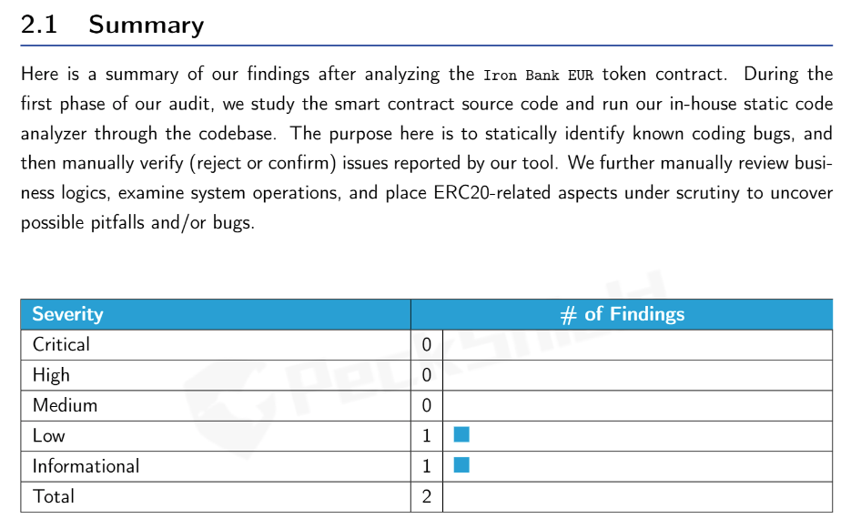

Author: [Andre Cronje](https://twitter.com/AndreCronjeTech) 

August 3rd, 2021

I wanted a sensationalist title. An audits role on public perception is bad, an audit for personal use, is good.

Nowadays you'll see audits being requested, not to be reviewed, but simply as a line item. "Is the project audited? \[Yes\] \[No\]", often, the link to the audit won't even be required, simply \[Yes\]\[No\].

Let's use Fixed Forex as an example, "Is the project audited?" \[Yes\], and here is the [audit](https://github.com/andrecronje/fixed-forex-audit/blob/main/PeckShield-Audit-Report-ERC20-ibEUR-v1.0.pdf). You might have even opened the link, and then you might have even scrolled down to the findings;

Great right? 1 low and 1 informational. But now let's look at it contextually, this is essentially an ERC20 contract, and while it does show that ibEUR and subsequent ib-assets are a simple ERC20 implementation, what about the rest of the ecosystem?

[ibEUR gauge](https://etherscan.io/address/0x9d7ca778d067045a9d6b871c9d28589875308018)  
[ibKRW gauge](https://etherscan.io/address/0x8992fd229b574b8083de1249bc6fd3711fda45dd)  
[Voting](https://etherscan.io/address/0xd9c8620c0c0b866b7b5180d2d70093165340326d)  
[Faucet](https://etherscan.io/address/0x7d254d9adc588126edaee52a1029278180a802e8)  
[ibEUR/ETH distribution](https://etherscan.io/address/0x1da8a6fe33bd35b99505d67843eec9fa124f2d4b)  
[ib rewards](https://etherscan.io/address/0x83893c4a42f8654c2dd4ff7b4a7cd0e33ae8c859)  
[Fee distribution](https://etherscan.io/address/0x27761efeb0c7b411e71d0fd0aee5dde35c810cc2)

Now, its very easy for me to have left it at a simple tweet, "Fixed Forex audit report", and be done with that, and this is why, even in the past, I hated sharing audit reports, we use them as a stamp of approval, non-technical individuals use it as confirmation that they are "safe". Nothing about what we are doing is safe, nothing about what we are trying to do is easy, and we have no future guarantees.

Decentralization is a responsibility, not a right, real decentralization is incredibly hard, and almost impossible to happen over night.

There is real elegance in truly being able to own your funds, but there is an inherent responsibility.

Teams should use audits to supplement, its the same reason peer coding works well, or even a simple peer review, but audits are not a stamp of approval, audits are not a guarantee, and audits are not a safety net.

In fact, if I saw an audit like the above, where a team said they are "audited" and all they did was audit their ERC20, I would be even more cautious.
